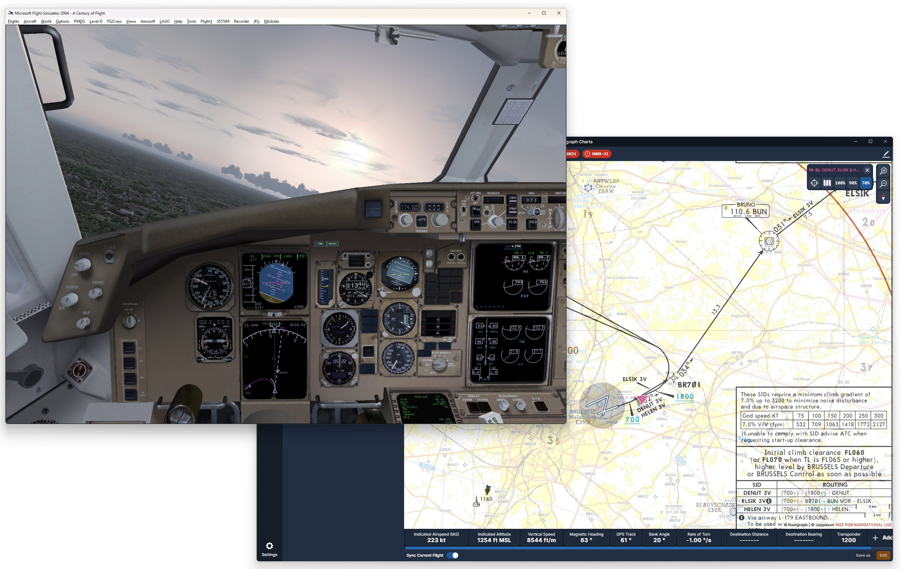
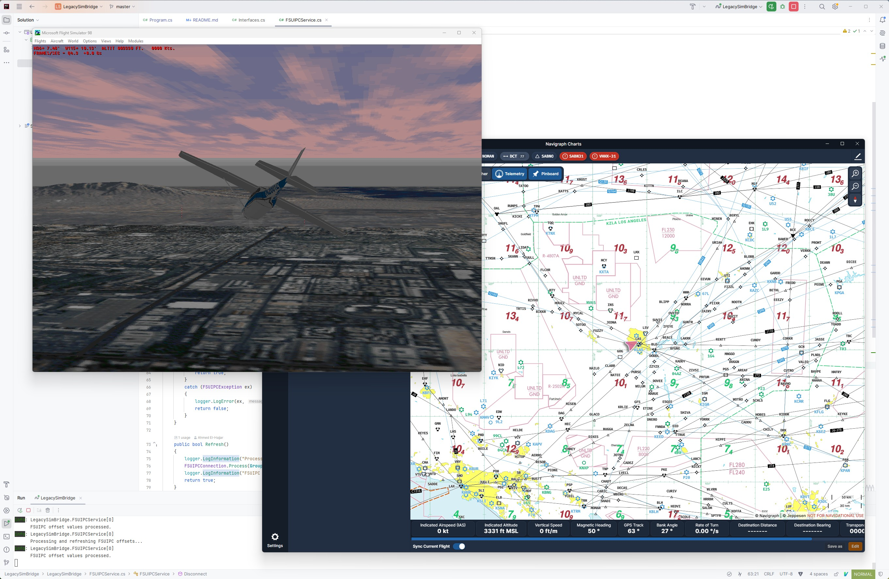

# Crosswind

Crosswind is a compatibility layer that connects various modern EFBs to desktop flight simulators. 

It is currently a proof-of-concept to allow using Microsoft Flight Simulator 2004 with Navigraph Charts. More EFBs are planned to be supported like LittleNavmap and ForeFlight. With possible expansions to support simulators other than MSFS and X-Plane like FlightGear, Aerofly FS, and Condor. 

Only available through the command line for now.

## Demo

Here you can see Navigraph Charts working in conjuction with Microsoft Flight Simulator 2004.



And yes, you're not crazy and look closely, this is Flight Simulator 98 with Navigraph!



## Usage

Download the latest release and extract the archive anywhere on your system. Within a command line, you can run the `crosswind` command.

For example, this is the command that you can use to bridge Flight Simulator 2004 with Navigraph Charts. FS2004 is using FSUIPC as an interface and Charts relies on Simlink.

```
.\crosswind.exe -i fsuipc -t simlink -s 1
```

Remember that Flight Simulator and Simlink must be both running.

Your simulator must have the [FSUIPC module](https://www.fsuipc.com/) or [XPUIPC plugin](https://fsacars.com/downloads/xpuipc/) installed.

## Requirements

Crosswind requires .NET Desktop Runtime 8.0.414 to run. You can [download it here on the official Microsoft .NET download website](https://dotnet.microsoft.com/en-us/download/dotnet/8.0).

Windows 10 and later should be supported. Though only Windows 11 24H2 was tested.

## Building

Crosswind was written in the JetBrains Rider IDE though should be compatible with VS Code and Visual Studio.

Make sure you have the .NET SDK 8.0.414 installed on your system. You can [download it here on the official Microsoft .NET download website](https://dotnet.microsoft.com/en-us/download/dotnet/8.0).

Then you can run the following command.
```
dotnet publish -c Release -r win-x64 --self-contained -p:PublishSingleFile=true
```

In the `bin\Release\net8.0\win-x64\publish` you can find `Crosswind.exe`

## Compatibility

### Supported EFBs

| Tool | Versions                            | Tested                          | Protocol                         |
| - |-------------------------------------|---------------------------------|----------------------------------|
| Navigraph Charts | 8.38 or later  | ✔️|  Navigraph Simlink 1.1 Protocol  |


### Supported Flight Simulators

| Simulator                       | APIs       | Tested | Original Release Date |
|---------------------------------|------------|--------|-----------------------|
| Laminar Research X-Plane 9      | XPUIPC 2.0 | ✔️     | June 2007             |
| Microsoft Flight Simulator 2004 | FSUIPC3    | ✔️     | July 2003             |
| Microsoft Flight Simulator 2002 | FSUIPC2    | ❌      | October 2001         |
| Microsoft Flight Simulator 2000 | FSUIPC2    | ❌      | November 1999         |
| Microsoft Flight Simulator 98   | FSUIPC2    | ✔️     | August 1997          |

## Support

Report any issues you may have. Open to contributions and pull requests. And feedback especially since I'm not fluent in C# or the .NET ecosystem.

## External Libraries

Uses the [FSUIPC Client DLL](http://fsuipc.paulhenty.com/#licence) for .NET by Paul Henty.

## Disclaimer

This is an experimental project for personal and educational purposes only. Use at your own risk.

Use of this project must not bypass or circumvent licensing restrictions, EULAs, or other contractual terms of third-party software.

Crosswind is distributed under the permissive MIT License.